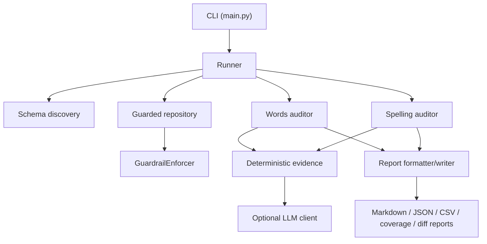

# Architecture

## System diagram

## Module responsibilities
- `config.py`: env + JSON config loading
- `cli.py`: argument parsing
- `runner.py`: orchestration
- `guardrails.py`: phase-1 read-only enforcement
- `db/schema_discovery.py`: explicit schema discovery and reporting
- `db/repository.py`: all SQL access through one guarded layer
- `auditors/*`: app-specific audit logic
- `intelligence/*`: deterministic evidence, confidence, fallback, optional LLM
- `reports/*`: formatting, writing, and diffing
- `models/*`: shared run, finding, and coverage models

## Guardrail design
- every query is validated before execution
- phase 1 permits only `SELECT`
- spelling queries may only touch `public.spelling_*`
- words queries may only touch explicitly discovered allowlisted words tables
- unknown or ambiguous schema results in failure reporting, not guessing

## Auditor group design
### Words
- reads only discovered Words schema
- audits synonym/antonym/compound/headword-answer quality
- avoids cross-app joins

### Spelling
- reads only `spelling_*`
- audits pattern grouping, hint relevance, example sentence quality, and outliers

## Intelligence flow
1. deterministic rules run first
2. semantic checks optionally degrade or skip depending on `llm_fallback_policy.json`
3. confidence policy determines whether a weak signal becomes a finding

## Reporting flow
1. run-level payload assembled
2. findings serialized with full evidence blocks
3. latest reports updated
4. previous latest compared for diff

## Future approval flow
Phase 2, if ever added, must:
- require explicit approver ID
- require before/after capture
- require rollback plan
- limit batch size
- keep an audit trail outside of the learning write path
